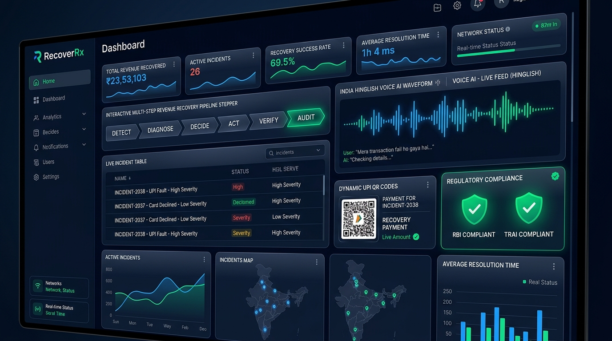
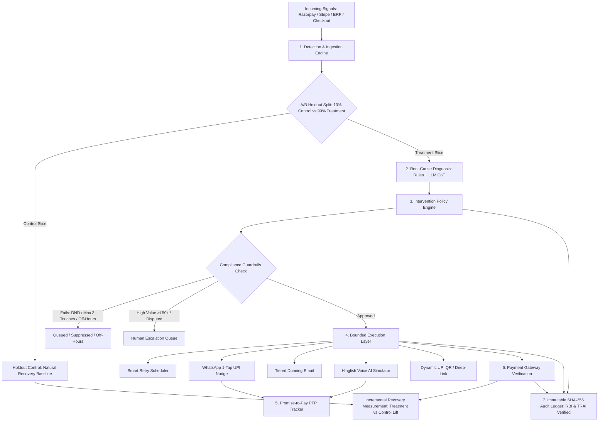

# RecoverRx 🛡️💸
### *The Diagnosis-and-Treatment Engine for Revenue*

[](https://python.org)
[](#compliance--regulatory-layer)
[](https://github.com/ananditaa2/razorpay)
[](LICENSE)



---

## 📌 The Problem

Revenue doesn't die in one dramatic moment — it leaks through many small, disconnected failures:
1. **Card payments fail silently** (insufficient funds, expired cards, bank declines, 3DS timeouts) and no one notices until subscriptions cancel.
2. **Checkouts get abandoned** at the OTP or payment step — high buyer intent is lost to friction.
3. **Subscription renewals fail** and blind retry logic retries the same dead card at the same time until the account cancels.
4. **B2B invoices go overdue** and companies either spam generic templated emails or ignore chronic late payers until cash flow breaks.
5. **UPI Autopay / NACH mandates fail** and blind resubmissions burn the mandate instead of adapting timing to salary disbursement cycles.

Treating these as separate tickets, separate dashboards, and separate teams fails to answer the causal question: **Why did this specific revenue stop flowing, and what is the minimum, compliant action that gets it flowing again?**

---

## 🔁 The Closed-Loop Pipeline

RecoverRx unifies all 5 failure archetypes into one continuous, causal loop: **Detect → Diagnose → Decide → Act → Verify → Audit**.



---

## ⚡ Key Capabilities

### 1. Signal Ingestion (Detect)
- Ingests webhooks from **Razorpay**, **Stripe**, **PayU**, checkout session logs, and ERP receivables aging data.
- Normalizes disparate signals into a unified `RevenueAtRiskEvent` schema.
- Allocates a deterministic 10% slice to an uncontacted **A/B Holdout Control Group** using hash modulo to prevent contamination.

### 2. Root-Cause Diagnosis (Diagnose)
- Hybrid rules + LLM Chain-of-Thought (CoT) reasoning engine.
- Maps raw error codes to causal categories:
  - **Hard Decline**: Dead/stolen/expired card token $\rightarrow$ Suppress retries; prompt card update.
  - **Soft Decline**: Insufficient balance, temporary downtime $\rightarrow$ Silent smart retry at salary cycle / off-peak.
  - **Checkout Friction**: SMS OTP lag $\rightarrow$ Instant 1-tap WhatsApp checkout bypassing OTP.
  - **Invoice Disputed**: Line-item or PO contest $\rightarrow$ **Immediately freeze automated dunning** per RBI fair practices.
  - **Mandate Balance**: Month-end bounce (NPCI `E01`) $\rightarrow$ Schedule retry post-salary credit (1st/5th).

### 3. Intervention Policy Engine (Decide)
- Hard-coded, immutable stopping rules:
  - **Max Touches Cap**: Strictly $\le 3$ contact attempts per incident.
  - **Cool-off Intervals**: Minimum 24 hours between customer touches.
  - **TRAI NDNC Compliance**: Customers registered on National Do Not Call registry are automatically downgraded to non-intrusive email only.
  - **Calling Window Restrictions**: Voice AI outreach strictly restricted to 09:00 - 20:00 IST.
  - **High-Value Threshold**: Accounts $>₹50,000$ or chronic defaulters trigger Human-in-the-Loop review.

### 4. Bounded Execution Layer (Act)
The agent can only invoke strictly authorized tools:
- `Tool_SmartRetry`: Dynamic routing switch and off-peak timing.
- `Tool_WhatsAppNudge`: Verified business template with 1-click Razorpay checkout & cart reservation.
- `Tool_DunningEmail`: Professional tiered dunning with ICICI virtual account escrow details.
- `Tool_VoiceAISimulator`: Respectful, conversational **Hinglish Voice AI recovery call** (`hi-IN`) with interactive waveform and speech synthesis.
- `Tool_UPILinkGenerator`: Dynamic NPCI compliant `upi://pay?...` deep links and QR codes.
- `Tool_HumanCollectorTask`: High-priority supervisor task queue with pre-configured settlement terms.

### 5. Promise-to-Pay (PTP) Ledger
- Logs customer verbal commitments (*"Friday ko salary ke baad pay kar dunga"*).
- Monitors deadlines and auto-checks settlement.
- Calibrates dynamic **Customer Trust & Credibility Scores** (0–100%).
- Automatically escalates upon broken promises.

### 6. A/B Holdout Verification & Incremental Measurement
- Proves true causal recovery vs. natural resolution:
  $$\text{Incremental Lift (\%)} = \text{Recovery Rate}_{\text{treatment}} - \text{Recovery Rate}_{\text{control}}$$
  $$\text{True Incremental Recovered (₹)} = \text{Treatment Revenue (₹)} \times \text{Incremental Lift (\%)}`$$
- Real-time ROI multiple calculation against operational outreach costs.

### 7. Cryptographic SHA-256 Audit Trail
- Every detection, diagnosis, decision, and bounded action is cryptographically hash-chained in an SQLite ledger.
- Full tamper-evident verification ensuring compliance with **RBI Debt Recovery Fair Practices** and **TRAI Commercial Communications Regulations**.

---

## 🚀 Quick Start

### Prerequisites
- Python 3.12+
- Standard web browser (Chrome, Edge, Firefox, Safari)

### 1. Clone the Repository
```bash
git clone https://github.com/ananditaa2/razorpay.git
cd razorpay
```

### 2. (Optional) Pre-load Seed Data
```bash
python seed_data.py
```

### 3. Run Automated Tests
```bash
python -m unittest tests/test_pipeline.py
```
*(All 7 tests validate ingestion, diagnosis, policy guardrails, PTP lifecycle, and audit integrity).*

### 4. Start the Server
```bash
python server.py
```
Open **[http://localhost:8080](http://localhost:8080)** in your browser to launch the Executive Command Center!

---

## 📁 Repository Structure

```
razorpay/
├── assets/
│   └── hero.jpg                      # Command Center UI Showcase
├── engines/
│   ├── detection.py                  # Webhook & Telemetry Normalizer + Holdouts
│   ├── diagnosis.py                  # Root-Cause Rules + LLM CoT Classifier
│   ├── policy.py                     # Intervention Policy & Regulatory Guardrails
│   ├── execution.py                  # Bounded Action Registry (WhatsApp, Voice, UPI)
│   ├── ptp.py                        # Promise-to-Pay Ledger & Credibility Tracker
│   ├── verification.py               # Incremental Lift Math & 72h Attribution
│   └── compliance.py                 # SHA-256 Chain Verifier & RBI/TRAI Auditing
├── public/
│   ├── index.html                    # Luxury Glassmorphic Command Center Dashboard
│   ├── styles.css                    # Dark Obsidian FinTech Design System
│   └── app.js                        # Real-Time Telemetry & Simulation Controller
├── tests/
│   └── test_pipeline.py              # End-to-End Automated Test Suite
├── database.py                       # SQLite Persistence & Hash Chaining
├── pipeline.py                       # Master Pipeline Orchestrator
├── schemas.py                        # Unified Domain Schemas & Enums
├── seed_data.py                      # Realistic 5-Archetype Seed Dataset
├── server.py                         # Production Multithreaded REST API Server
├── .gitignore
└── README.md
```

---

## 📡 REST API & Webhook Endpoints

| Method | Endpoint | Description |
|---|---|---|
| `GET` | `/api/analytics` | Executive KPIs, Incremental Lift %, and ROI multiple |
| `GET` | `/api/events` | List all normalized revenue-at-risk incidents |
| `GET` | `/api/events/<id>` | Deep-dive causal trace and audit timeline for an incident |
| `POST` | `/api/events/simulate` | Trigger any of the 7 pre-built revenue failure simulations |
| `POST` | `/api/webhooks/razorpay` | Real-time Razorpay webhook receiver (`payment.failed`, etc.) |
| `POST` | `/api/webhooks/checkout` | Real-time Checkout funnel drop-off telemetry receiver |
| `POST` | `/api/webhooks/erp_invoice`| ERP Receivables Net-30/60 invoice aging ingestion |
| `POST` | `/api/webhooks/payment_success` | Ingest successful settlement & calculate attribution |
| `GET` | `/api/ptp` | Active Promise-to-Pay commitment ledger |
| `POST` | `/api/ptp/fulfill` | Mark commitment as kept and credit recovery |
| `POST` | `/api/ptp/break` | Mark commitment as broken and trigger escalation |
| `GET` | `/api/audit` | Cryptographic SHA-256 audit trail & compliance report |
| `GET` / `POST`| `/api/settings` | Configure touch caps, cool-off hours, and API keys |

---

## 🛡️ Compliance & Regulatory Layer

- **RBI Outsourcing & Debt Recovery Guidelines**:
  - Zero abusive or threatening outreach.
  - Strict touch caps ($\le 3$ contacts per incident).
  - Immediate and mandatory collection freeze on disputed invoices.
  - Automatic escalation to human supervisors for large balances.
- **TRAI NDNC Regulations**:
  - Strict 09:00 - 20:00 IST permitted calling hours.
  - National Do Not Call registry verified before any voice call or SMS.
  - 1-click STOP opt-out killswitch.

---

## 📄 License
This project is licensed under the MIT License — see the [LICENSE](LICENSE) file for details.
